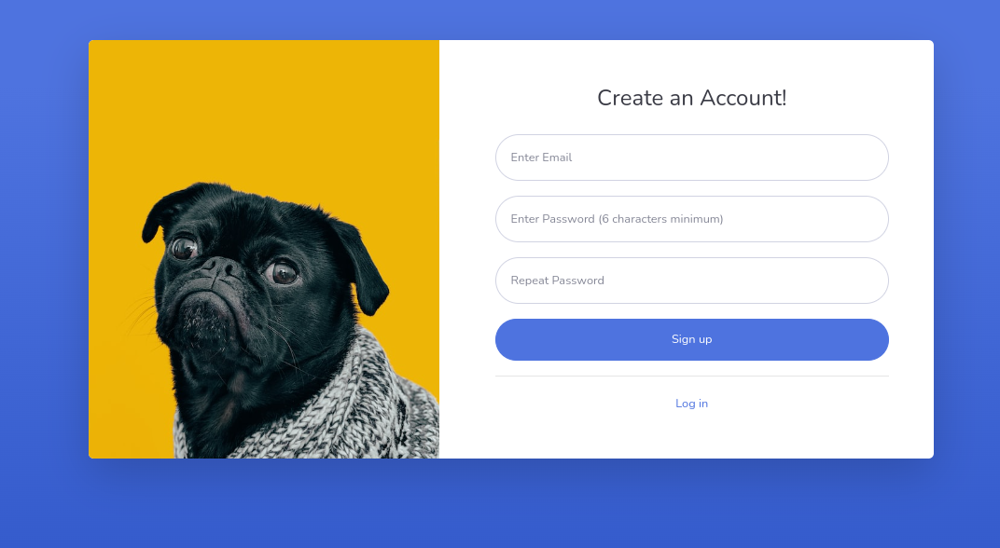
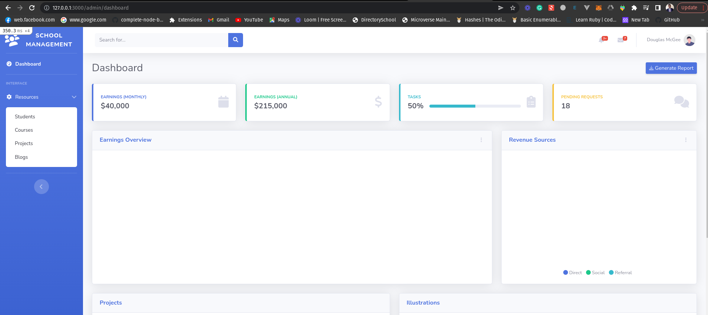
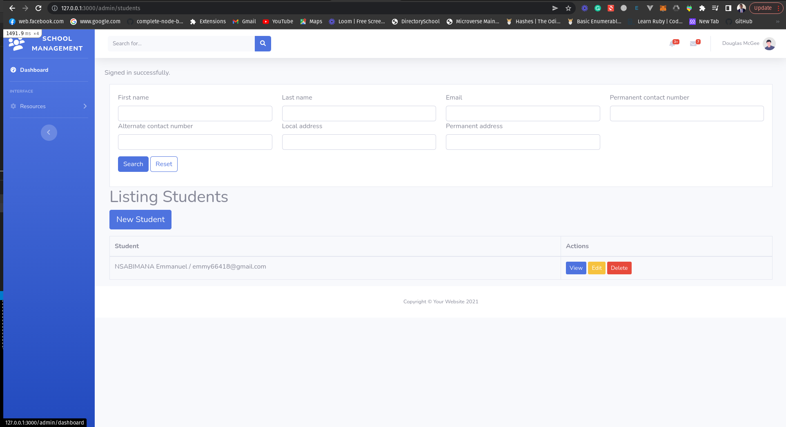
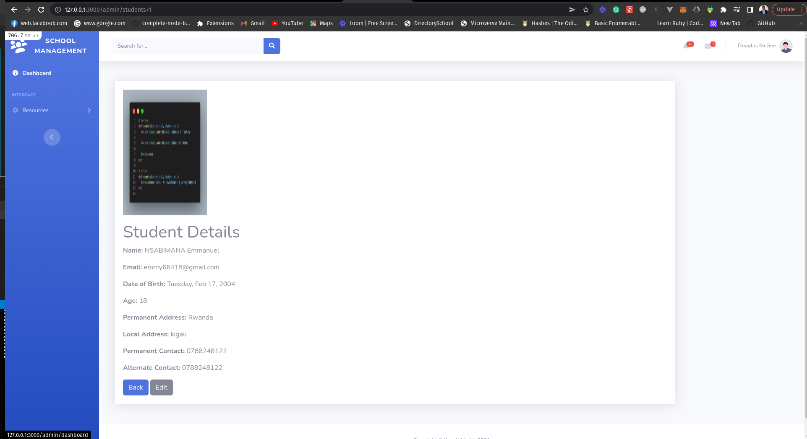

# Content covered to implement the School management project

- Create Models/understanding models
- Rails migration
- Creating Resource controller in Rails
- Seeding Data in rails
- Listing Resource Data on Browser
- Creating Form for Resource in Rails
- Implement Create/show/edit/update/destroy actions for Resource controller
- Partials in Rails
- Summarising the resource controller
- Rails MVC Architecture
- Rails scaffolding
- Scaffold vs Resources
- ActiveRecord Model
- ActiveRecord Migrations
- Schema Versioning in Rails
- Rails Migration for creating multiple tables
- Migration for Add/Remove/Rename attributes in Table
- Reversible Migrations in Rails
- Run specific Migration in Rails
- Old version Rails migrations

- ActiveRecord Associations in Rails
      - has_many/belongs_to/has_and_belongs_to_many/has_many:through/has_one/has_one :through/Polymorphic Association in Rails


- ActiveRecord callbacks

      callbacks executed on creating/updating an object.

      before_validation
      after_validation
      before_save
      around_save
      before_create/update
      around_create/update
      after_create/update
      after_save
      after_commit/ after_rollback

      callbacks executed on deleting an object.

      before_destroy
      around_destroy
      after_destroy
      after_commit /after_rollback


      Common callbacks

      For Create/Update/Delete

      - after_commit/ after_rollback

      For Create/Update

      - before_validation
      - after_validation
      - before_save/around_save/after_save


- ActiveRecord Validations

      Model Level Validations :are the best way to ensure that only valid data are saved into database 

           - Database constraints
           - Client Side Validations
           - Controller Level Validations


      Example validations

           - presence
           - uniqueness
           - numericality
           - format

- Instance Methods for ActiveRecord Objects

- ActiveRecord Queries in Rails

- find/find_by in rails

- first and last methods in rails ActiveRecord

- Where/limit methods in ActiveRecord and Order/Select query in ActiveRecord

- Array vs Query Methods in Rails

- N+1 query problems and it's solution

- Eager Loading in Rails

- ActionController in details and ActionController callbacks in Rails

- Action View in Rails

- Rails Routing in Details
          - Member and Colletion Routinf
          - Namespace and Scope Routing in Rails

- ActiveSupport Concerns in Rails

- Action Helpers in Rails (helper or controller)

- Helper Methods into Controllers

- Webpacker in Rails

- Working with Bootstrap/bulma and tailwind in Components

- Bootstrap Admin theme integration in Rails

- Managing CRUD in admin Namespace

- Pagination Rails Models using Kaminari gem/ pagy and will_paginate

- Search Implementation using Ransack gem or LIKE operator from SQL

- Devise implementation (before_action, logout link in Bootstrap) and customizing Devise Views

- ActiveStorage in Rails

- Upload Attachment in Rails

- ActionText in Rails

- Working with Trix Editor as ActionText in Rails

- Rake Tasks in Rails

- Creating Rake Task Using Rails generator

- ActionMailer in Rails

- Send Email in Rails and Preview using letter_opener gem

- Extending Rails partials to display model validation errors

- Integrated Javascript in Rails (Implemented cookie in rails using javascript)


### Screenshot of the signup


### Screenshot of the signin


### Screenshot of the admin


### Screenshot of the admin_student


### Screenshot of the show student data



## Getting Started

To get a local copy up and running follow these simple example steps:


## Built With

* Ruby v3.0.0
* Ruby on Rails v7.0.4
* Postgres: >=13.4-1
* SQLite3
* Node.js v16.10.0
* Yarn v1.22.18


### Setup and Install

* Open your terminal - Windows: `Win + R`, then type `cmd` | Mac: `Command + space`, then type `Terminal`
* Navigate to a directory of your choosing using the `cd` command
* Run this command in your OS terminal: `https://github.com/Emmyn5600/School-management-project.git` to get a copy of the project
* Navigate to the project's directory using the `cd` command
* Install dependencies by running `bundle install`
* Migrate the database to your environment by running `rails db:create` then `rails db:migrate`
* Run `rails webpacker:install` to configure Webpacker for your environment. Otherwise, an error like `Webpacker::Manifest::MissingEntryError` will appear if you attempt to run the server.
* Execute `rails server` to fire up the server
* Visit `http://localhost:3000/` in your browser to get into the app
* Interact with the app
* To close the server, enter `Ctrl + C` in your terminal

### Setup

Instal gems with:

```
bundle install

yarn install
```

Setup database with:

```
   rails db:create
   rails db:migrate
```

### Github Actions

To make sure the linters' checks using Github Actions work properly, you should follow the next steps:

1. On your recently forked repo, enable the GitHub Actions in the Actions tab.
2. Create the `feature/branch` and push.
3. Start working on your milestone as usual.
4. Open a PR from the `feature/branch` when your work is done.

### Usage

Start server with:

```
    rails server
```

Open `http://localhost:3000/` in your browser.

### Run tests

```
    bundle exec rspec
```

👤 **NSABIMANA Emmanuel**

- GitHub: [@emmyn5600](https://github.com/Emmyn5600)
- Twitter: [@NSABIMA62253884](https://twitter.com/NSABIMA62253884)
- LinkedIn: [@nsabimana-emmanuel-4276091b2](https://www.linkedin.com/in/nsabimana-emmanuel-4276091b2/)

## Credits

Thanks to (coming soon......)

## 🤝 Contributing

Contributions, issues, and feature requests are welcome!

Feel free to check the [issues/](https://github.com/Emmyn5600/School-management-project/issues).


